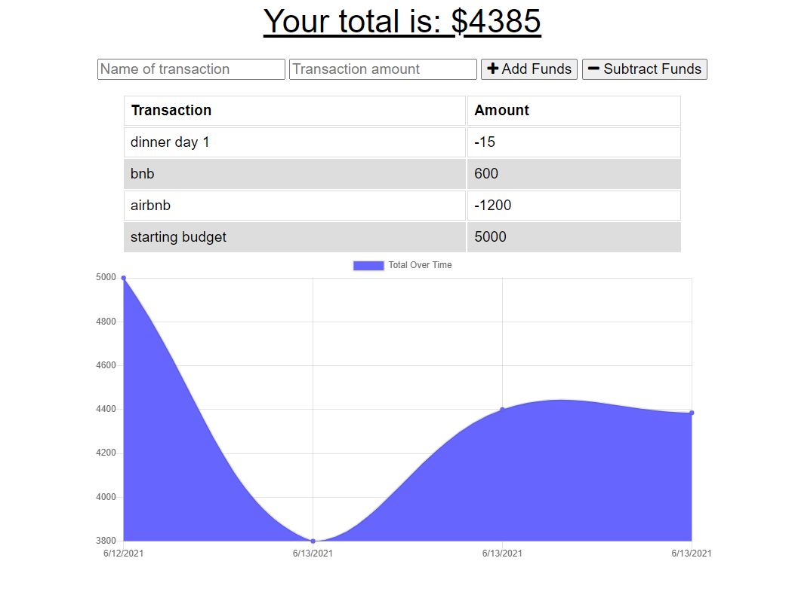

# budget-tracker-app

 

## Description

Heroku and MongoAtlas deployed app that uses mongodb and mongoose. Keep up with your budget by adding expenses and deposits to the app with or without a connection. Go to the [live site](https://fast-beyond-03402.herokuapp.com/) or follow the steps to see how to use.

## How To

- Go to [live site](https://fast-beyond-03402.herokuapp.com/)
- Enter the name of the transaction
- Enter the amount to add or subtract
- Select add funds or subtract funds depending on the transaction

### Important Links

- [Live site](https://fast-beyond-03402.herokuapp.com/)

### Images

### License

MIT License
